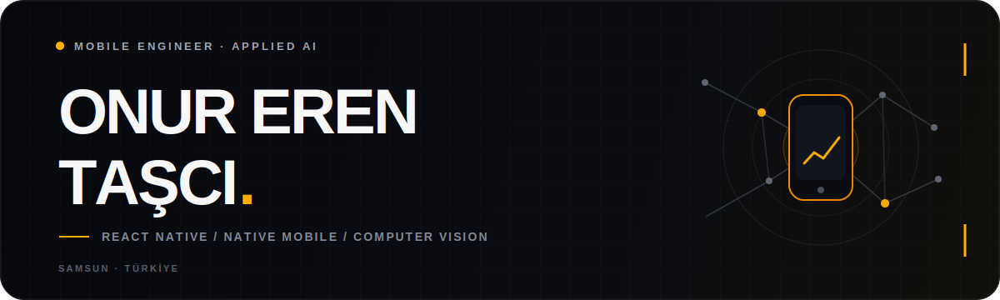

  

  <a href="https://onurerentasci.com/">Portfolio</a>
  &nbsp;·&nbsp;
  <a href="https://vespula.com.tr/tr">Vespula</a>
  &nbsp;·&nbsp;
  <a href="https://www.linkedin.com/in/onurerentasci">LinkedIn</a>
  &nbsp;·&nbsp;
  <a href="mailto:onurerentasci@gmail.com">Email</a>

  
  
  
  

## Engineering products, not just screens.

I'm a mobile engineer focused on the point where polished interaction meets real-world engineering: cross-platform architecture, native capabilities, computer vision and on-device AI.

I build production-ready experiences across iOS and Android, taking products from early architecture and interface decisions through performance work, deployment and iteration. At [Vespula](https://vespula.com.tr/tr), I work on mobile products and AI-powered systems with a small, hands-on engineering team.

> My favorite problems live between the interface and the inference.

## Selected work

| Product | What it does | Built with |
| :--- | :--- | :--- |
| **[NannAI](https://onurerentasci.com/#projects)** | On-device health assistant for food recognition, calorie tracking and personalized allergen insights. | `React Native` `YOLO11` `Deep Learning` |
| **[Tennis Analysis ML](https://github.com/onurerentasci/tennis_analysis_ml)** | Detects court keypoints, players and ball movement, then maps the match to a real-time minimap. | `PyTorch` `ResNet50` `OpenCV` |
| **[Genera](https://github.com/onurerentasci/Genera)** | Generative-image social platform with profiles, galleries and real-time interactions. | `Next.js` `Node.js` `MongoDB` |
| **[Artify](https://github.com/onurerentasci/Artify)** | Mobile AI image generation experience powered by Stable Diffusion APIs. | `Expo` `React Native` `Firebase` |

## Core stack

  

**Mobile** — React Native, Expo, Swift, native modules, RevenueCat, Reanimated

**AI** — Python, PyTorch, computer vision, YOLO, on-device inference

**Platform** — Node.js, Firebase, Supabase, PostgreSQL, Docker, CI/CD

## Field notes

- 🥇 **1st place** — TÜBİTAK 2242, Defense category
- ✈️ **Finalist** — Fighting UAV Competition
- 🧠 Building at the intersection of **mobile, AI and robotics**
- 📍 Based in **Samsun, Türkiye**

  
<strong>GitHub activity</strong>

   
  

    
    
  

 

  <a href="mailto:onurerentasci@gmail.com"><strong>Have a product worth building? Let's talk.</strong></a>
    
  

