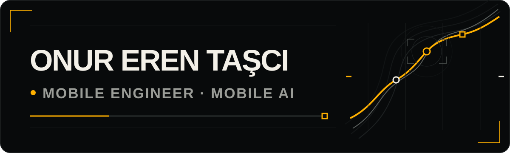
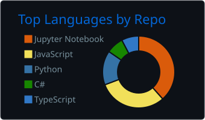
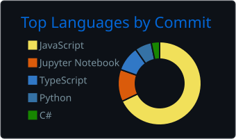

  

  <a href="https://onurerentasci.com/"><strong>Portfolio</strong></a>
  &nbsp;·&nbsp;
  <a href="https://vespula.com.tr/en"><strong>Vespula</strong></a>
  &nbsp;·&nbsp;
  <a href="https://www.linkedin.com/in/onurerentasci"><strong>LinkedIn</strong></a>
  &nbsp;·&nbsp;
  <a href="mailto:onurerentasci@gmail.com"><strong>Email</strong></a>

  
  
  
  

## Mobile products where interface meets intelligence.

I'm a mobile engineer working across product architecture, native capabilities, performance-sensitive interaction and AI integration. I build for iOS and Android, taking products from early technical decisions through release and iteration.

My focus is practical: React Native when shared product velocity matters, native code when the platform demands it, and on-device AI when privacy or latency makes the cloud the wrong place.

### Building with Vespula

I'm part of [Vespula](https://vespula.com.tr/en)'s three-person core team as **Mobile Engineer · Mobile AI**. We design and ship mobile, web, backend and AI-native products with direct engineering ownership from idea to production.

[Explore Vespula's work →](https://vespula.com.tr/en)

### Core stack

  <strong>Mobile</strong>
    
  &nbsp;&nbsp;
  &nbsp;&nbsp;
  &nbsp;&nbsp;
  &nbsp;&nbsp;
  &nbsp;&nbsp;
  

  <strong>AI &amp; vision</strong>
    
  &nbsp;&nbsp;
  &nbsp;&nbsp;
  &nbsp;&nbsp;
  

  <strong>Product platform</strong>
    
  &nbsp;&nbsp;
  &nbsp;&nbsp;
  &nbsp;&nbsp;
  &nbsp;&nbsp;
  &nbsp;&nbsp;
  &nbsp;&nbsp;
  

### Beyond the app layer

- Contributed to İKARUS's UAV and ground-control systems; the team placed **1st at TÜBİTAK 2242** in the Defense, Space & Aerospace category and reached the **Fighting UAV Competition final**.
- Previously led a university AI and robotics community and taught IoT and embedded programming.
- Based in **Samsun, Türkiye**.

### GitHub activity

<!-- Generated daily by .github/workflows/profile-summary-cards.yml -->

  

  
  

   
  Have a mobile or AI-native product worth building?
   
  <a href="mailto:onurerentasci@gmail.com"><strong>Let's talk →</strong></a>

